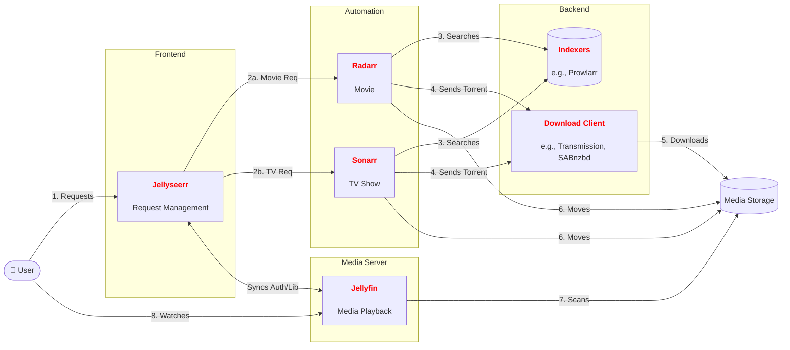

# ---
layout: image-right
image:  https://jellyfin.org/assets/images/10.8-home-4a73a92bf90d1eeffa5081201ca9c7bb.png
backgroundSize: 30em 50%
transition: fade
hideInToc: true
---

📽️ Media server

* Media server: **[Jellyfin](https://jellyfin.org/)**
* Alternatives: [Plex](https://www.plex.tv/), [Emby](https://emby.media/), [Kodi](https://kodi.tv/)

<!--

* Plex: gets increasingly _less_ free and _less_ open-source
* Emby: father of Jellyfin before it changed its license and became closed-source in ~2018
* Kodi: Not really a media-server per se but highly configurable so you could
  use it as one. Not as user-friendly and robust as JF though. can still use it
  as JF client

-->

---
transition: fade
hideInToc: true
---

# 📽️ Media server - Why Jellyfin?

Convenient, easy-to-use: Provide native or progressive web apps

TODO

---
transition: fade
hideInToc: true
---

# 📽️ Media server - Why Jellyfin?

I'd like to download "Metropolis (1927)"

* Use a torrent client (e.g., Transmission) - download to Jellyfin-shared
    storage.
  + ❌Have to manually search for the torrent, download it, and move it to the
      right folder for JF
  + ❌Have to explicitly refresh JF library

* Use [Radarr](https://radarr.video/)
  + ✅Link to torrent indexes
  + ✅Link to torrent client
  + ✅Search for movie in Radarr, click "Download"
  + ❌Too technical (have to specify acceptable quality, codecs, etc.)

* 

---
transition: fade
hideInToc: true
---

# 📽️ Media server - Why Jellyfin?

Easy to *download* new content

---
transition: fade
hideInToc: true
---

# 📽️ Media server - Why Jellyfin?

Easy to *share* content with friends and family

---
transition: fade
hideInToc: true
---

# 📽️ Media server - the full picture

