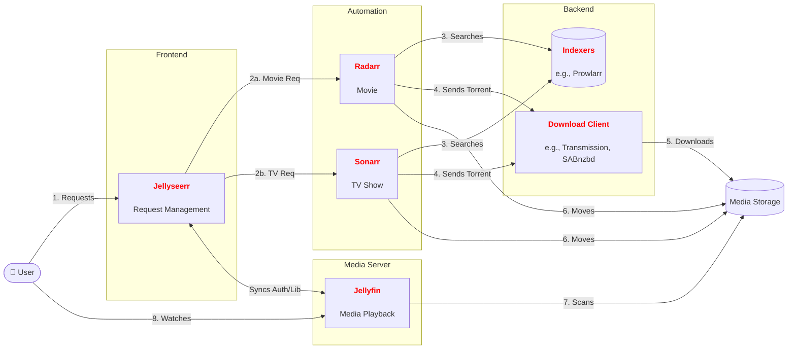

# Make your own homelab

## Build, manage, and secure your personal self-hosted setup

---
hideInToc: true
---

# Previously on homelab ...

* What's a homelab? Definition and terms
* Environment setup, tools to use, prior knowledge
* App bringup
* Reverse proxying
* SSL certificate issuing
* VPN configuration
* Backup strategies - data redundancy

---
layout: image-right
image: https://www.cnet.com/a/img/resize/d07ee1249a5dbddf4d06f9275d6354bf91fda6a1/hub/2017/01/14/6d8103f7-a52d-46de-98d0-56d0e9d79804/se7en.png?auto=webp&width=1920
hideInToc: true
---

# What's in the ~~box~~ presentation?

<Toc text-sm minDepth="1" maxDepth="2" />

---
---

# 📚 Book management
---
---

# 📃 Document management / knowledge base

---
---

# 🏗️ Homelab infrastructure maintenance

---
---

# 🍎 Meal planning / Stock management at home

---
transition: fade
---

# 📽️ Media server

## Goals

* Cross platform: Watch content (movies, TV series, etc.) across devices, OS-es
* Convenient, easy-to-use: Provide native or progressive web apps
* Easy to *download* new content
* Easy to *share* content with friends and family

<!--

* Cross platform not only in terms of applications but also in terms of having a
    `server - client` model

-->

---
layout: image-right
image:  https://jellyfin.org/assets/images/10.8-home-4a73a92bf90d1eeffa5081201ca9c7bb.png
backgroundSize: 30em 50%
transition: fade
hideInToc: true
---

# 📽️ Media server

* Media server: **[Jellyfin](https://jellyfin.org/)**
* Alternatives: [Plex](https://www.plex.tv/), [Emby](https://emby.media/), [Kodi](https://kodi.tv/)

<!--

* Plex: gets increasingly _less_ free and _less_ open-source
* Emby: father of Jellyfin before it changed its license and became closed-source in ~2018
* Kodi: Not really a media-server per se but highly configurable so you could
  use it as one. Not as user-friendly and robust as JF though. can still use it
  as JF client

-->

---
transition: fade
hideInToc: true
---

# 📽️ Media server - Why Jellyfin?

Convenient, easy-to-use: Provide native or progressive web apps

TODO

---
transition: fade
hideInToc: true
---

# 📽️ Media server - Why Jellyfin?

I'd like to download "Metropolis (1927)"

* Use a torrent client (e.g., Transmission) - download to Jellyfin-shared
    storage.
  + ❌Have to manually search for the torrent, download it, and move it to the
      right folder for JF
  + ❌Have to explicitly refresh JF library

* Use [Radarr](https://radarr.video/)
  + ✅Link to torrent indexes
  + ✅Link to torrent client
  + ✅Search for movie in Radarr, click "Download"
  + ❌Too technical (have to specify acceptable quality, codecs, etc.)

* 

---
transition: fade
hideInToc: true
---

# 📽️ Media server - Why Jellyfin?

Easy to *download* new content

---
transition: fade
hideInToc: true
---

# 📽️ Media server - Why Jellyfin?

Easy to *share* content with friends and family

---
transition: fade
hideInToc: true
---

# 📽️ Media server - the full picture

---
---

# 🔒Password management

---
---

# 💡 Productivity
